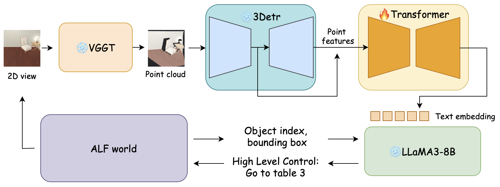

# 3D-VIoLA: 3D Visual Information of Embodied Scene Views for Language-Action Prediction

We introduce 3D-VioLA, a system for Language-Action Prediction that enables high-level control in object management tasks using large language models (LLMs). 3D-VioLA converts 2D camera views into 3D point clouds using VGGT, then projects this visual information into text representations through a learned projector. With the 3D visual information, LLM can perform better spatial reasoning and provide more accurate control to the robot.

## Pipeline



## Environment setup

We extracts 3D features from point cloud data using [3DETR](https://github.com/facebookresearch/3detr), with a little our own modification.

---
Navigate to the `3D-perception/detr3d` directory:

```
cd 3D-perception/detr3d
```

### 1. Install Dependencies

Install dependencies (requires **Python 3.8**, **PyTorch 1.10.0**, and **CUDA 11.3**):

```
pip install torch==1.10.0 torchvision==0.11.1 torchaudio==0.10.0 --index-url https://download.pytorch.org/whl/cu113
pip install transformers==4.20.0
```

Then, follow the installation guide provided in the official [3DETR repository](https://github.com/facebookresearch/3detr) to complete the setup.

---

### 2. Download Pretrained Weights

Run the following script to download the pretrained model:

```
python utils/download_weights.py
```

---
## Training
Under 3D-perception directory:
``` 
python train.py [--dataset_root_dir data_path]
```

## Inference and Evaluation
```
python inference.py
```


 
