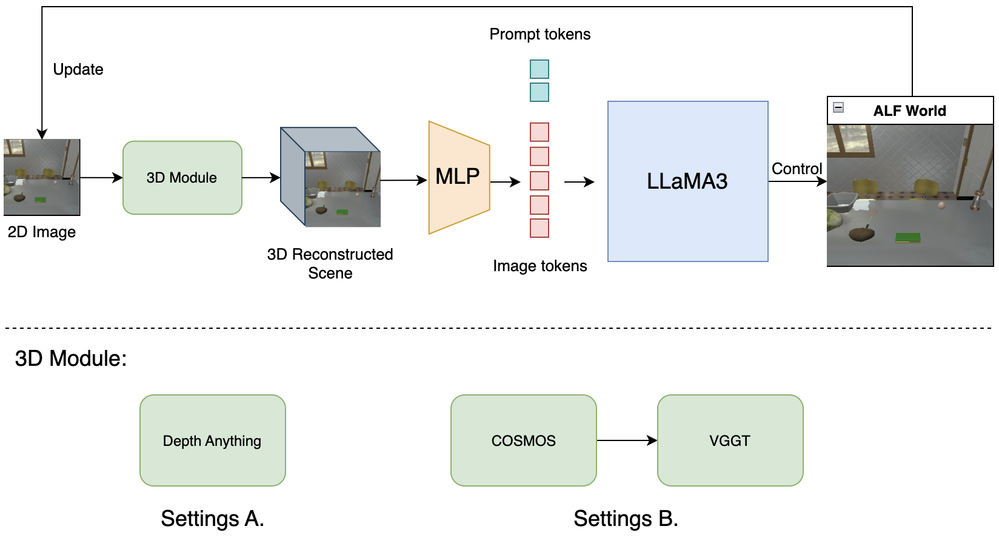
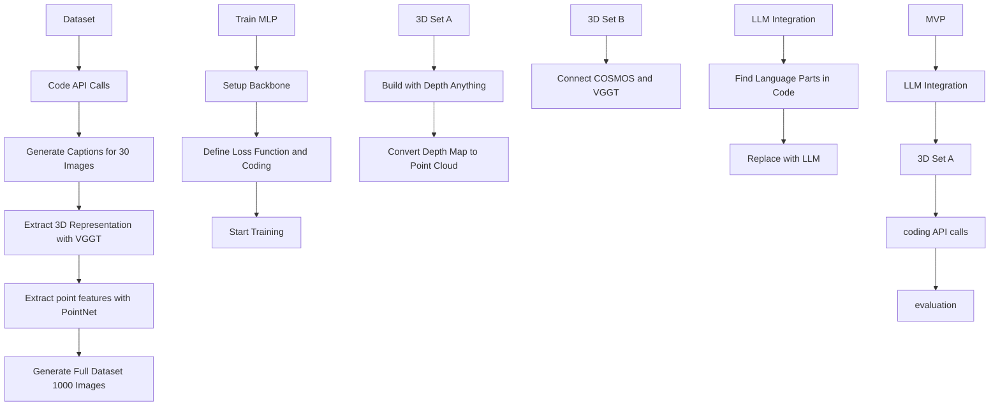

# 3D-VIoLA: 3D Visual Information of Embodied Scene Views for Language-Action Prediction

All the shared information will be placed in this repo. Please frequently check for the updates and join the discussions.

### Pipeline

### Development

- **Dataset**: coding api calls -> generate caption for small set (30) -> get 3D representation with VGGT -> generate whole dataset (1000)
- **3D setB**: connect cosmos and VGGT
- **Train MLP**: setup backbone -> setup loss function and coding -> start training
- **3D setA**: build depth anything -> depth map to point cloud
- **LLM**: find language parts in code -> replace with LLM
- **MVP**: TODO minimum viable product

### Important Dates

- 6/1 finish MVP
- 6/7 MLP training finish
- 6/10 poster presentation

### Milestones

### MVP

 
