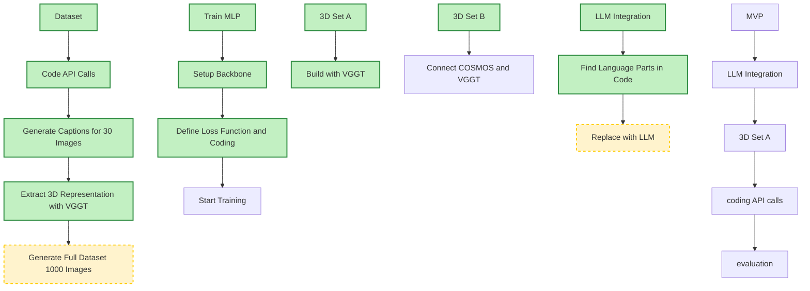

# 3D-VIoLA: 3D Visual Information of Embodied Scene Views for Language-Action Prediction

All the shared information will be placed in this repo. Please frequently check for the updates and join the discussions.

### Pipeline

### Development

### Important Dates

- 6/1 finish MVP
- 6/7 MLP training finish
- 6/10 poster presentation

### Milestones

- [ ] LLM integration
- [ ] Build Depth Anything
- [ ] Build PointNet++
- [ ] MVP
- [ ] Build dataset
- [ ] Train MLP

### MVP

Replace the MLP with API.

 
